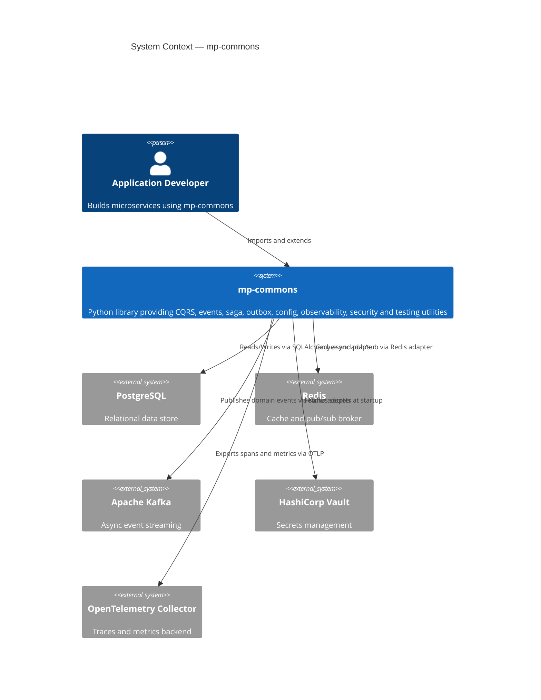
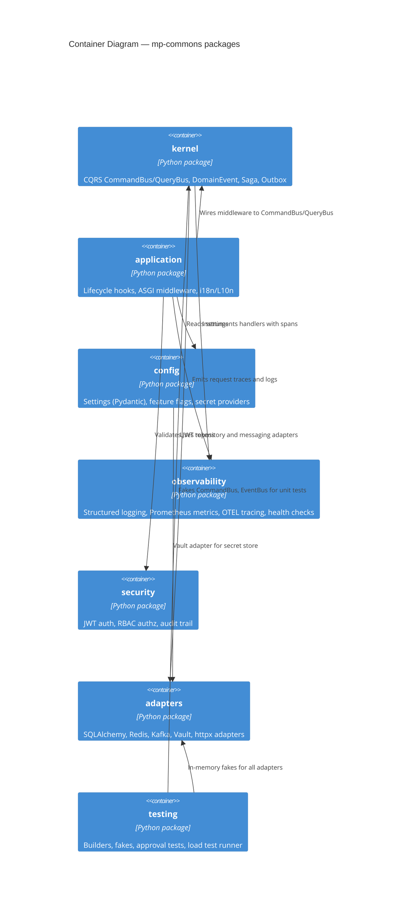
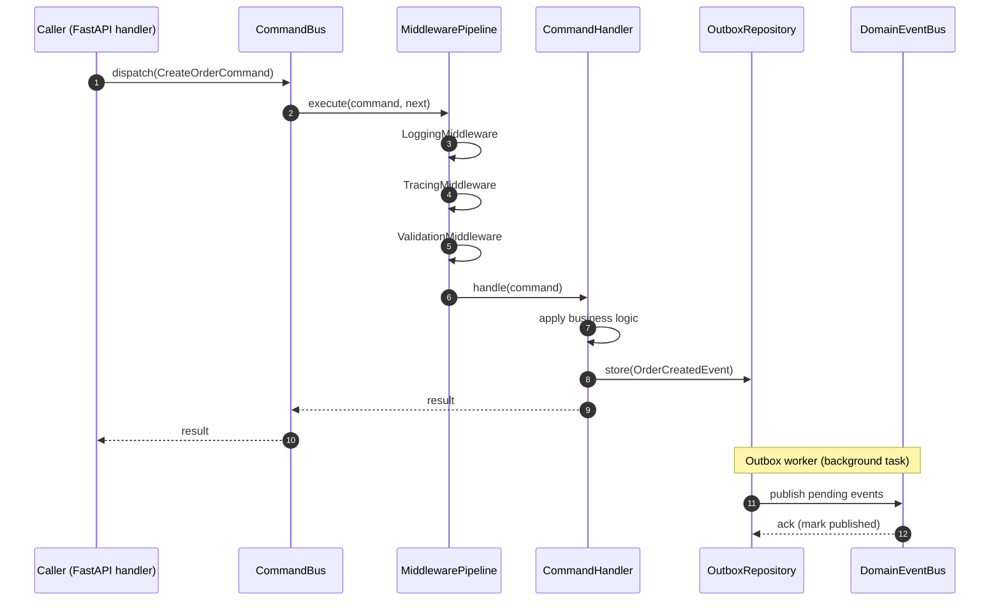
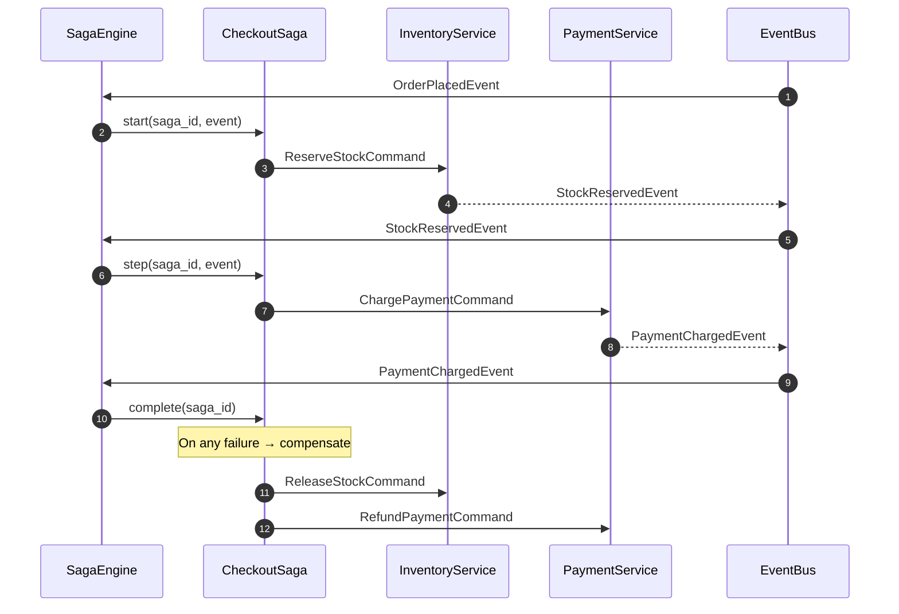
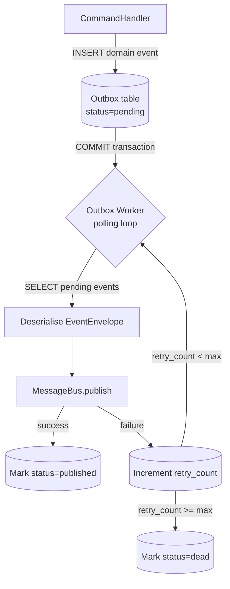

# Architecture Diagrams

C4 model diagrams rendered with [Mermaid](https://mermaid.js.org/).

---

## Level 1 — System Context

Shows mp-commons in relation to the systems that use it.

---

## Level 2 — Container

Internal package structure and dependencies.

---

## Level 3 — Component: CQRS Dispatch Flow

Sequence showing how a command travels through the system.

---

## Level 3 — Component: Saga Orchestration

Sequence showing a multi-step saga coordinating across services.

---

## Level 3 — Component: Outbox Relay

How domain events are durably delivered after the command transaction commits.

